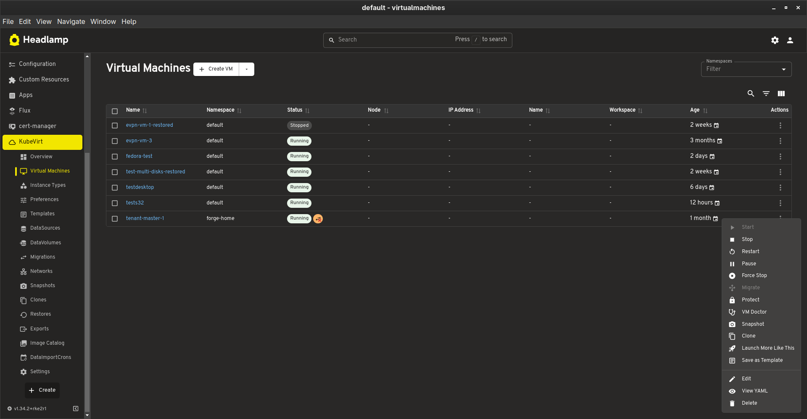
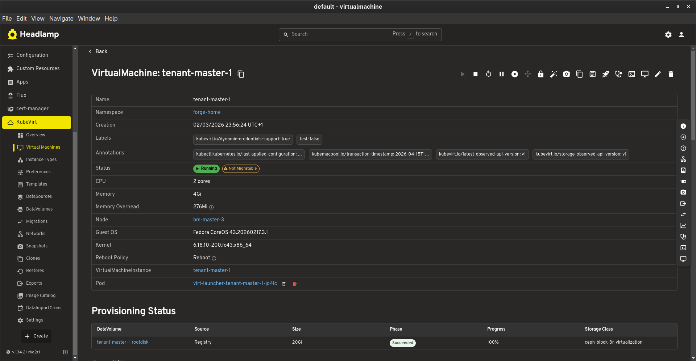
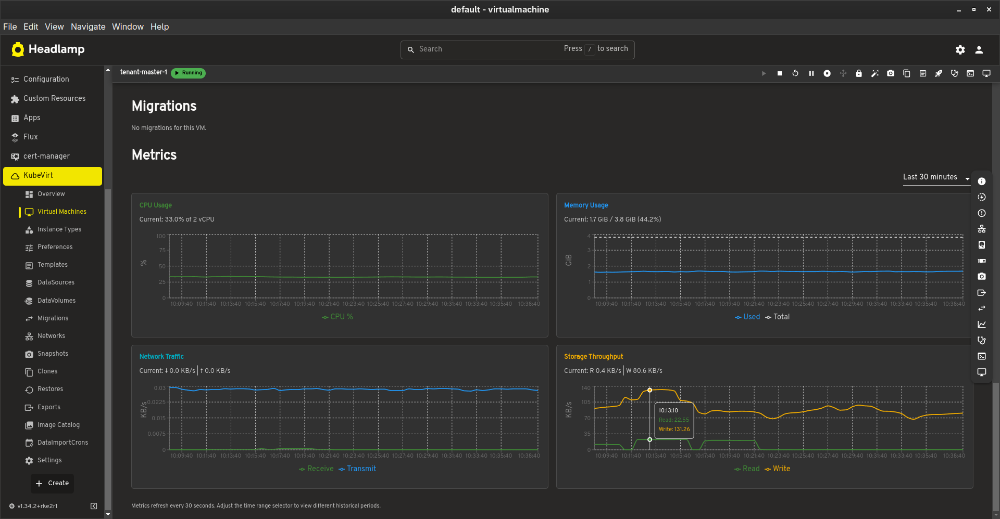
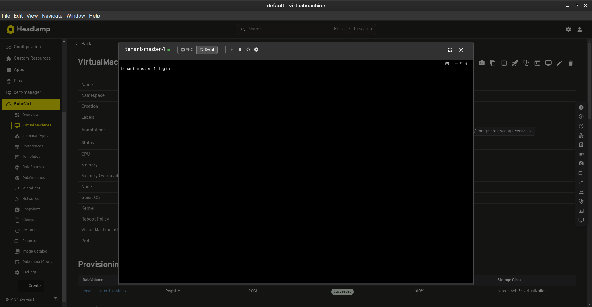
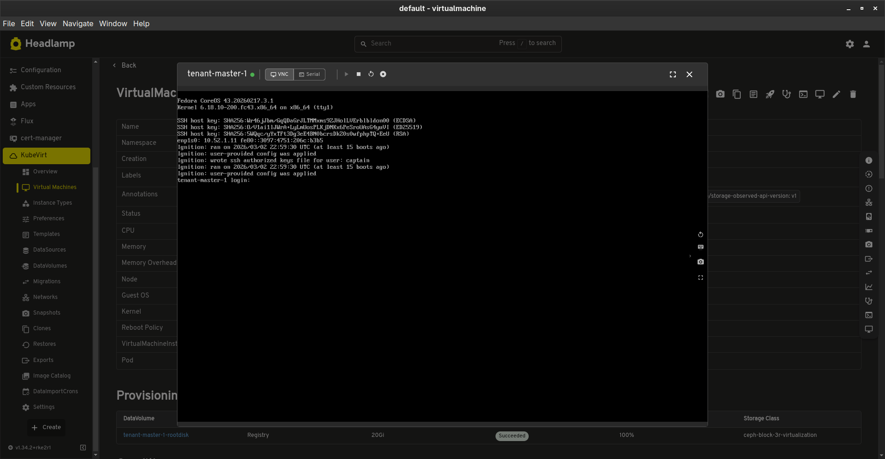
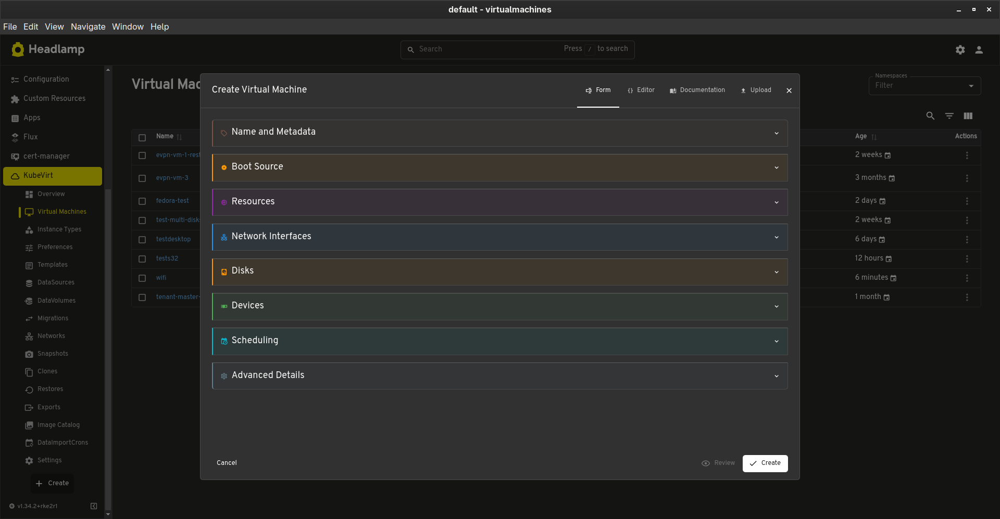
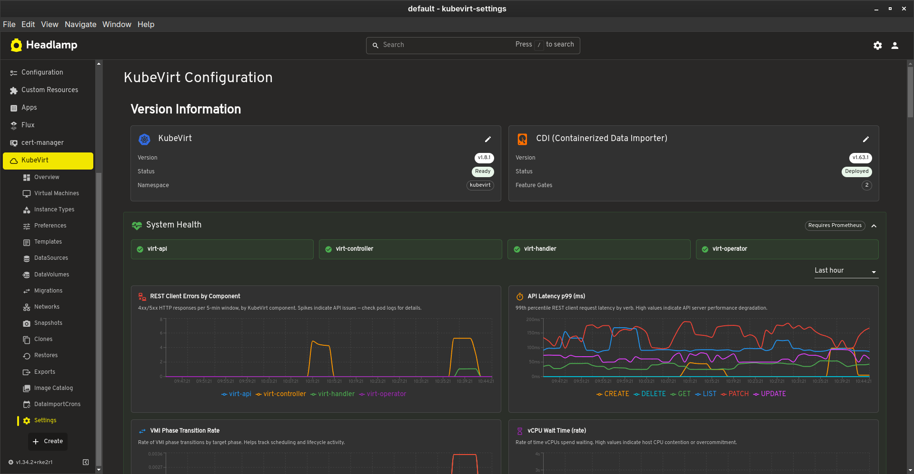
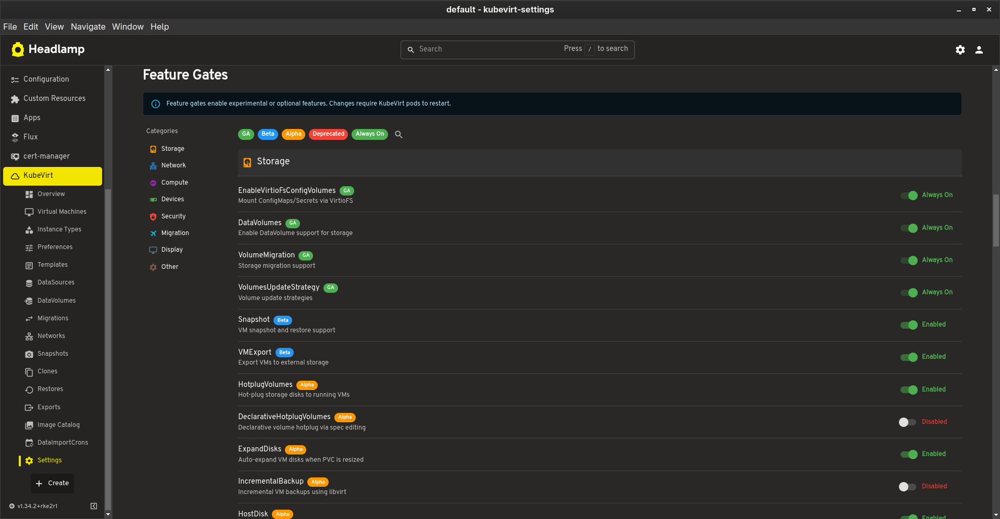

# Headlamp KubeVirt Plugin

A comprehensive [Headlamp](https://headlamp.dev) plugin for managing [KubeVirt](https://kubevirt.io) virtual machines in Kubernetes.

Originally based on the excellent work from [buttahtoast](https://github.com/buttahtoast/headlamp-plugins/tree/main/kubevirt).

> **Disclaimer:** This is an independent community plugin. It is not maintained by, affiliated with,
> or endorsed by the [KubeVirt](https://kubevirt.io) project. For KubeVirt issues, please use the
> [KubeVirt issue tracker](https://github.com/kubevirt/kubevirt/issues). For issues with this plugin,
> please use [our issue tracker](https://github.com/naval-group/headlamp-kubevirt/issues).

## Features

- **Virtual Machines** - Full lifecycle management (create, start, stop, restart, migrate, pause, snapshot, export), VNC console, serial terminal, live metrics
- **Instance Types & Preferences** - Browse and manage VirtualMachineClusterInstanceTypes and VirtualMachineClusterPreferences
- **Bootable Volumes** - Manage DataSources, DataVolumes, and DataImportCrons for OS images
- **Networking** - Create and manage Network Attachment Definitions (Multus CNI)
- **Live Migration** - Monitor VirtualMachineInstanceMigrations
- **Snapshots & Exports** - Create and restore VM snapshots, export VMs
- **Overview Dashboard** - Cluster-wide VM status, Prometheus-powered metrics (CPU, memory, network, storage top consumers)
- **Settings** - KubeVirt/CDI version display, feature gate management, migration configuration, VM delete protection (ValidatingAdmissionPolicy)

## Screenshots

### Overview Dashboard

Prometheus-powered top consumers for CPU, memory, network, and storage across all VMs.


### Virtual Machine Management

Full lifecycle management with context menu actions: Start, Stop, Restart, Pause, Migrate, Protect, Edit, and Delete. Live migration notifications appear in the status bar.



### VM Details

Detailed view showing status, CPU, memory, node placement, guest OS info, and links to the VMI and virt-launcher pod.



Scroll down for network interfaces, disks & volumes, and live CPU/memory metrics charts.



### Console Access

Built-in serial console and VNC console for direct VM interaction.

|                  Serial Console                   |                 VNC Console                 |
| :-----------------------------------------------: | :-----------------------------------------: |
|  |  |

### Create Virtual Machine

Guided VM creation wizard with Form, Editor, Documentation, and Upload tabs. Configure name, boot source, resources, network interfaces, disks, scheduling, and advanced options.

|             Create VM Form              |                 API Documentation                 |
| :-------------------------------------: | :-----------------------------------------------: |
|  |  |

### Instance Types & Preferences

Browse and manage VirtualMachineClusterInstanceTypes and VirtualMachineClusterPreferences.

|                  Instance Types                   |                 Preferences                 |
| :-----------------------------------------------: | :-----------------------------------------: |
|  |  |

### Storage

Manage DataSources and DataImportCrons for automated OS image imports.

|                 DataSources                 |                      Create DataImportCron                      |
| :-----------------------------------------: | :-------------------------------------------------------------: |
|  |  |

### Networking

Create and manage Network Attachment Definitions with support for Bridge, Macvlan, IPvlan, VLAN, Host Device, SR-IOV, PTP, and TAP types.


### Live Migration

Monitor VirtualMachineInstanceMigrations with source/target node tracking and status.


### Settings & Feature Gates

View KubeVirt and CDI versions, manage feature gates with categorized toggle switches (Storage, Network, Compute, Devices, Security, Migration, Display).

|               Settings                |                  Feature Gates                  |
| :-----------------------------------: | :---------------------------------------------: |
|  |  |

## Prerequisites

- Kubernetes cluster with [KubeVirt](https://kubevirt.io/user-guide/cluster_admin/installation/) installed
- [CDI (Containerized Data Importer)](https://github.com/kubevirt/containerized-data-importer) for storage features
- Headlamp >= 0.24.0

## Installation

### Option 1: Desktop App (Plugin Mode)

For users running the Headlamp desktop application (Linux, macOS, Windows).

#### From Release Artifact

1. Download the latest `headlamp-kubevirt-*.tar.gz` from the [Releases](https://github.com/naval-group/headlamp-kubevirt/releases) page

2. Extract to your Headlamp plugins directory (the archive creates the `kubevirt/` folder automatically):

   **Linux (native)**

   ```bash
   tar -xzf headlamp-kubevirt-*.tar.gz -C ~/.config/Headlamp/plugins/
   ```

   **Linux (Flatpak)**

   ```bash
   tar -xzf headlamp-kubevirt-*.tar.gz -C ~/.var/app/io.kinvolk.Headlamp/config/Headlamp/plugins/
   ```

   **macOS**

   ```bash
   tar -xzf headlamp-kubevirt-*.tar.gz -C ~/Library/Application\ Support/Headlamp/plugins/
   ```

   **Windows (PowerShell)**

   ```powershell
   tar -xzf headlamp-kubevirt-*.tar.gz -C "$env:APPDATA\Headlamp\Config\plugins\"
   ```

3. Restart (or reload) Headlamp

#### From Source

```bash
git clone https://github.com/naval-group/headlamp-kubevirt.git
cd headlamp-kubevirt
npm install
npm run build
```

Then copy the files to the appropriate plugins directory:

```bash
mkdir -p ~/.var/app/io.kinvolk.Headlamp/config/Headlamp/plugins/kubevirt
cp dist/main.js package.json ~/.var/app/io.kinvolk.Headlamp/config/Headlamp/plugins/kubevirt/
```

### Option 2: In-Cluster (Container Mode)

For Headlamp deployed as a Kubernetes service. The plugin is served as an init container that copies the built plugin into a shared volume.

#### Using Helm

If you deploy Headlamp with the [official Helm chart](https://headlamp.dev/docs/latest/installation/in-cluster/), add the plugin as an init container:

```yaml
# values.yaml
initContainers:
  - name: headlamp-kubevirt
    image: ghcr.io/naval-group/headlamp-kubevirt:latest
    command: ['/bin/sh', '-c']
    args:
      - 'cp -r /plugins/kubevirt /headlamp-plugins/'
    volumeMounts:
      - name: headlamp-plugins
        mountPath: /headlamp-plugins

volumeMounts:
  - name: headlamp-plugins
    mountPath: /headlamp/plugins

volumes:
  - name: headlamp-plugins
    emptyDir: {}
```

Then install/upgrade:

```bash
helm repo add headlamp https://headlamp-k8s.github.io/headlamp/
helm upgrade --install headlamp headlamp/headlamp -f values.yaml
```

#### Using kubectl

```yaml
apiVersion: apps/v1
kind: Deployment
metadata:
  name: headlamp
spec:
  template:
    spec:
      initContainers:
        - name: headlamp-kubevirt
          image: ghcr.io/naval-group/headlamp-kubevirt:latest
          command: ['/bin/sh', '-c']
          args:
            - 'cp -r /plugins/kubevirt /headlamp-plugins/'
          volumeMounts:
            - name: headlamp-plugins
              mountPath: /headlamp-plugins
      containers:
        - name: headlamp
          image: ghcr.io/headlamp-k8s/headlamp:latest
          args:
            - '-plugins-dir=/headlamp/plugins'
          volumeMounts:
            - name: headlamp-plugins
              mountPath: /headlamp/plugins
      volumes:
        - name: headlamp-plugins
          emptyDir: {}
```

## Development

```bash
# Install dependencies
npm install

# Start development server (with hot reload)
npm run start

# Build for production
npm run build

# Run tests
npm run test

# Lint
npm run lint

# Type check
npm run tsc
```

## License

Apache-2.0
