# Headlamp KubeVirt Plugin

[](https://github.com/naval-group/headlamp-kubevirt/actions/workflows/build.yml)
[](https://github.com/naval-group/headlamp-kubevirt/actions/workflows/codeql.yml)
[](https://scorecard.dev/viewer/?uri=github.com/naval-group/headlamp-kubevirt)
[](https://www.bestpractices.dev/projects/12240)
[](https://artifacthub.io/packages/headlamp/headlamp-kubevirt/headlamp_kubevirt)
[](https://github.com/naval-group/headlamp-kubevirt/pkgs/container/headlamp-kubevirt)
[](https://github.com/naval-group/headlamp-kubevirt/releases/latest)
[](https://github.com/naval-group/headlamp-kubevirt/blob/main/LICENSE)
[](https://kubevirt.io)
[](https://headlamp.dev)
[](https://github.com/naval-group/headlamp-kubevirt/stargazers)

A comprehensive [Headlamp](https://headlamp.dev) plugin for managing [KubeVirt](https://kubevirt.io) virtual machines in Kubernetes.

Originally based on the excellent work from [buttahtoast](https://github.com/buttahtoast/headlamp-plugins/tree/main/kubevirt).

> **Disclaimer:** This is an independent community plugin. It is not maintained by, affiliated with,
> or endorsed by the [KubeVirt](https://kubevirt.io) project. For KubeVirt issues, please use the
> [KubeVirt issue tracker](https://github.com/kubevirt/kubevirt/issues). For issues with this plugin,
> please use [our issue tracker](https://github.com/naval-group/headlamp-kubevirt/issues).

## Features

- **Virtual Machines** - Full lifecycle management (create, start, stop, restart, force stop, migrate, pause, clone, snapshot, export, launch more like this, save as template), bulk actions, compare up to 3 VMs, VNC console with send keys, serial terminal with auto-resize, live per-VM metrics, desktop/tablet device auto-detection
- **VM Doctor** - Per-VM diagnostic panel with conditions, events, metrics, PromQL querier, guest OS info, VM/pod shell with virsh command reference, logs, YAML, memory dump with Volatility3 forensic analysis, and disk inspector
- **VM Templates** - Create, manage, and instantiate VirtualMachineTemplates with parameter substitution. One-click "Save as Template" from any VM
- **Image Catalog** - Built-in OS images and custom entries via ConfigMaps, with hide/show toggle and icon picker. See [Image Catalog docs](docs/image-catalog/README.md)
- **Instance Types & Preferences** - Browse and manage VirtualMachineClusterInstanceTypes and VirtualMachineClusterPreferences
- **Bootable Volumes** - Manage DataSources, DataVolumes (HTTP, Registry, S3, PVC, Upload), and DataImportCrons for OS images
- **Networking** - Create and manage Network Attachment Definitions (Multus CNI)
- **Live Migration** - Monitor VirtualMachineInstanceMigrations, volume live migration support (VolumeMigration)
- **Snapshots & Exports** - Create and restore VM snapshots, export VMs
- **Overview Dashboard** - Cluster-wide VM status, Prometheus-powered metrics (CPU, memory, network, storage top consumers)
- **Settings** - KubeVirt/CDI version info, system health monitoring (component status, REST errors, API latency, VMI phase transitions), configurable metrics endpoint (Prometheus, Thanos, Mimir), plugin features (VM delete protection, forensic toolbox, disk inspector), feature gates with maturity labels (GA/Beta/Alpha/Deprecated/Always On) and version-aware detection, RBAC aggregation, common instance types deployment, Prometheus monitoring (ServiceMonitor)

## Screenshots

### Overview Dashboard

Prometheus-powered top consumers for CPU, memory, network, and storage across all VMs.


### Virtual Machine Management

Full lifecycle management with context menu actions: Start, Stop, Restart, Pause, Force Stop, Migrate, Protect, VM Doctor, Snapshot, Clone, Launch More Like This, Save as Template, Edit, View YAML, and Delete. Multi-select rows for bulk actions (start, stop, migrate, delete) or compare up to 3 VMs side-by-side across metadata, spec, and status fields.


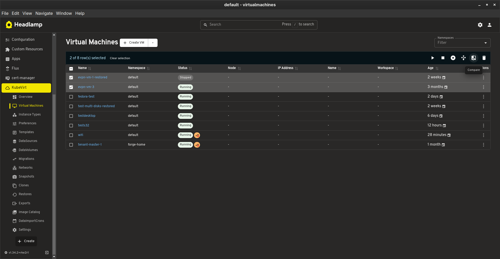

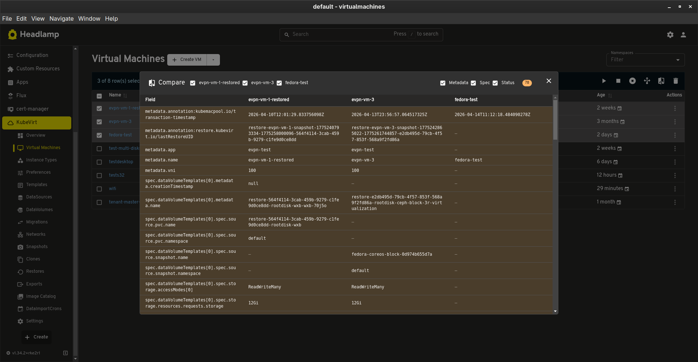

### VM Details

Detailed view showing status, CPU, memory, memory overhead, node placement, guest OS, kernel, reboot policy, and links to the VMI and virt-launcher pod. Action buttons in the top bar and a floating shortcut bar provide quick access to all VM operations. Provisioning status section tracks DataVolume import progress.


Scroll down for network interfaces, disks and volumes with volume live migration button, GPUs and host devices, snapshots, exports, migrations, and live CPU/memory/network/storage metrics charts.

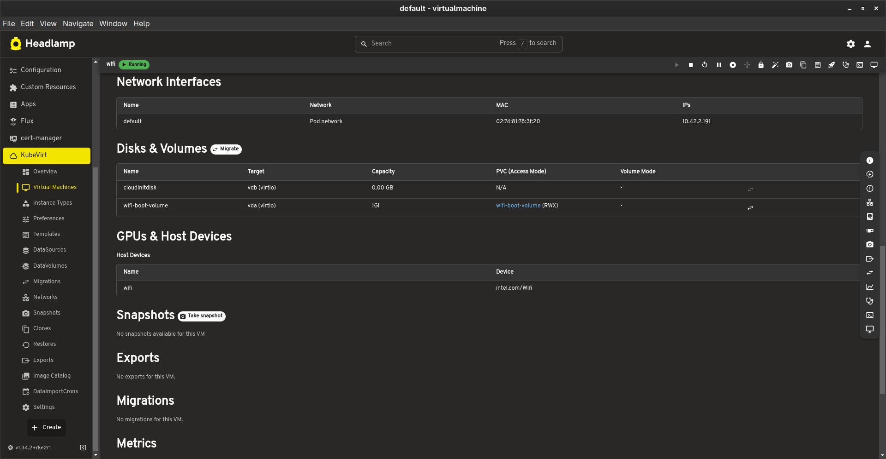


### Console Access

Built-in serial console with auto-resize and VNC console with send keys support. Automatically detects desktop VMs and suggests tablet device attachment for proper mouse tracking.

|                  Serial Console                   |                 VNC Console                 |
| :-----------------------------------------------: | :-----------------------------------------: |
|  |  |

### Create Virtual Machine

Guided VM creation with Form, Editor, Documentation, and Upload tabs. Configure name, boot source (DataSource, Registry, HTTP, S3, PVC, Upload, Blank, Image Catalog), resources, network interfaces, disks, devices (GPU/PCI passthrough, vTPM, watchdog), scheduling, and advanced options.


### Instance Types & Preferences

Browse and manage VirtualMachineClusterInstanceTypes and VirtualMachineClusterPreferences.

|                  Instance Types                   |                 Preferences                 |
| :-----------------------------------------------: | :-----------------------------------------: |
|  |  |

### Storage

Manage DataSources and DataImportCrons for automated OS image imports.

|                 DataSources                 |                      Create DataImportCron                      |
| :-----------------------------------------: | :-------------------------------------------------------------: |
|  |  |

### Networking

Create and manage Network Attachment Definitions with support for Bridge, Macvlan, IPvlan, VLAN, Host Device, SR-IOV, PTP, and TAP types.


### Live Migration

Monitor VirtualMachineInstanceMigrations with source/target node tracking and status.


### VM Templates

Create, edit, and instantiate VirtualMachineTemplates with parameter substitution. Save any existing VM as a template with one click from the VM list or details page. Process templates to create new VMs by filling in parameter values.

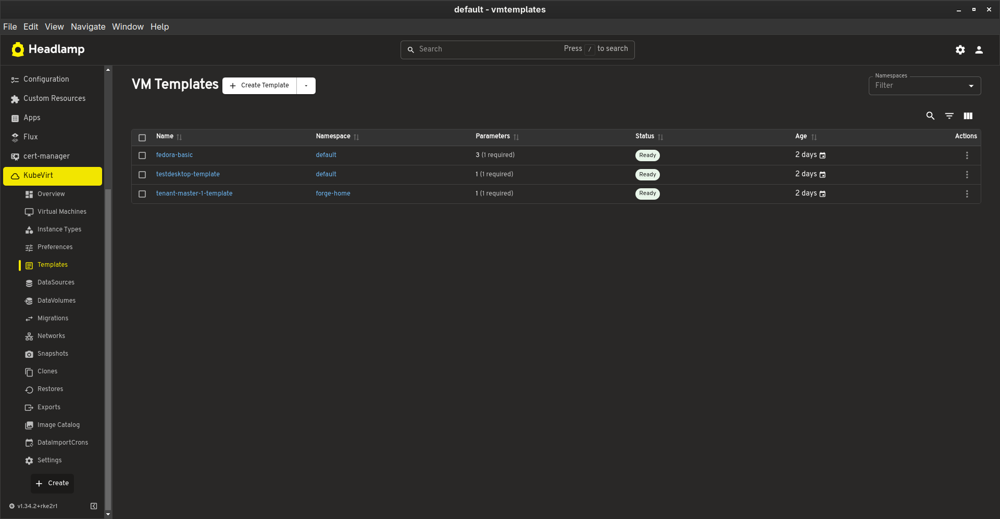

### VM Doctor

Per-VM diagnostic panel accessible from the VM details page. Provides a unified view of everything related to a VM across multiple tabs.

**Conditions** - Aggregated conditions from the VirtualMachine, VirtualMachineInstance, Pod, and DataVolumes. Highlights conditions that need attention.

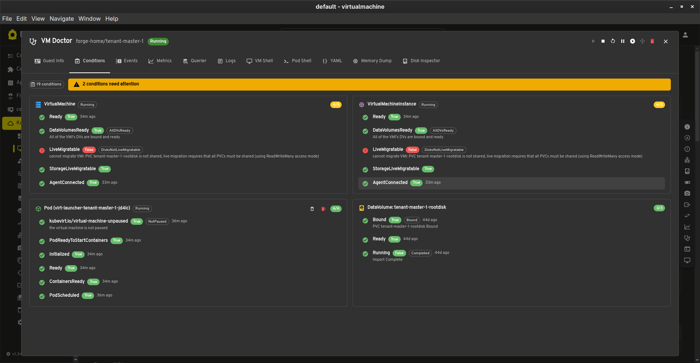

**Events** - Filtered Kubernetes events related to the VM, with type filtering and search.

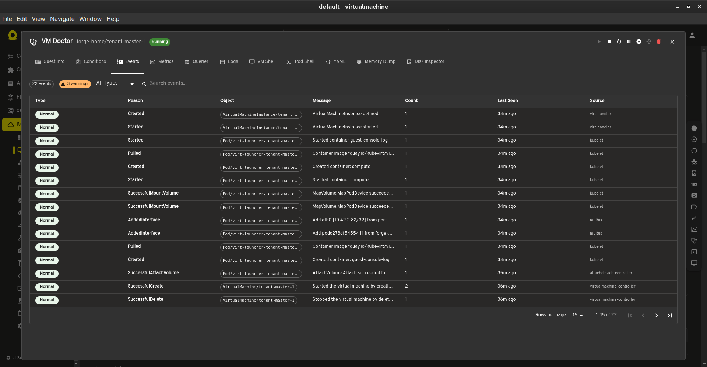

**Metrics** - Live CPU, memory, network throughput, storage throughput, storage IOPS, and swap activity charts powered by Prometheus.

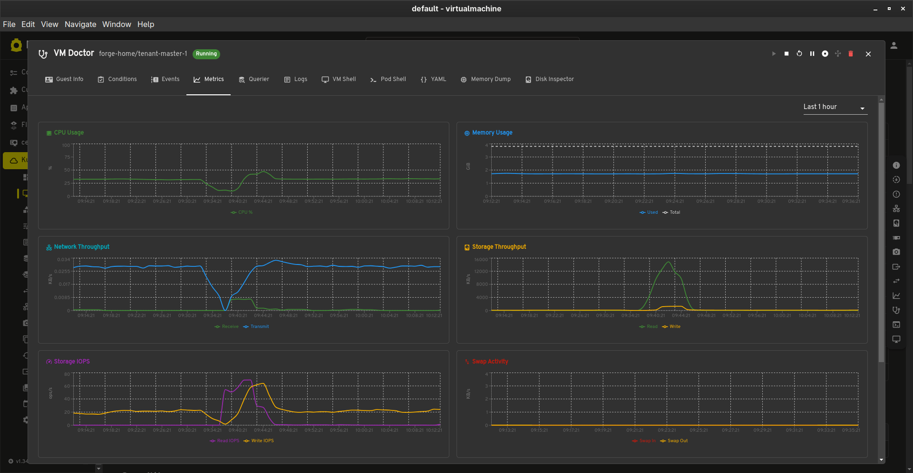

**Guest Info** - Operating system details, logged-in users, filesystems with usage bars, and network interfaces. Requires the QEMU guest agent.

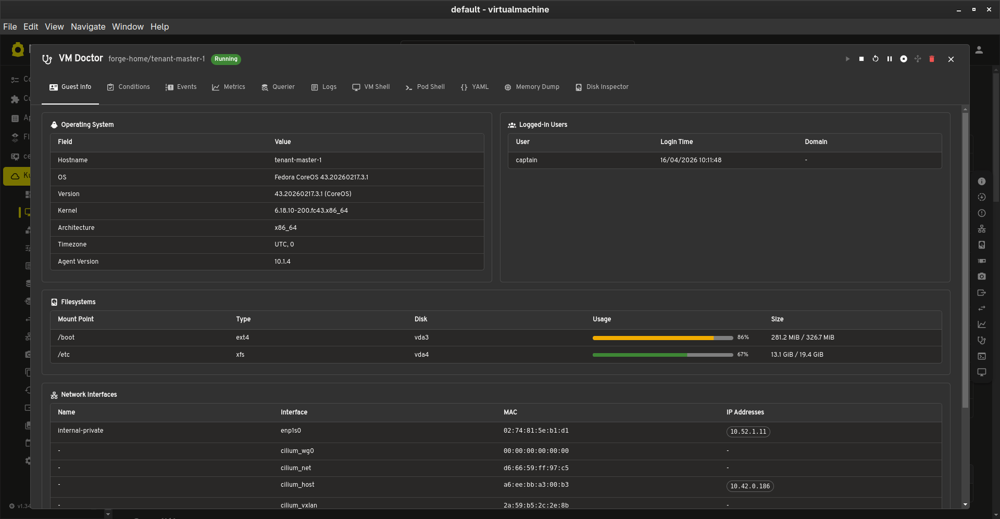

**Pod Shell** - Direct shell access to the virt-launcher compute container with a command reference sidebar. Click-to-run virsh commands for VM status, resources, configuration, and diagnostics.

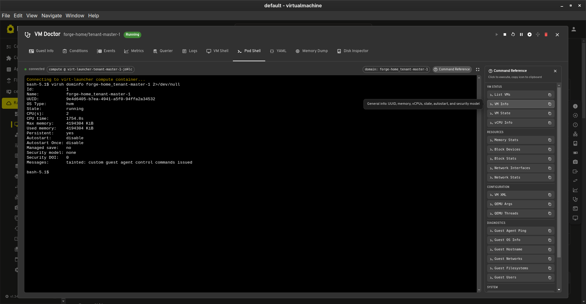

**Memory Dump** - Trigger and download VM memory dumps. Launch a Volatility3 forensic analysis pod with ISF symbol auto-detection, interactive shell, and command reference sidebar.

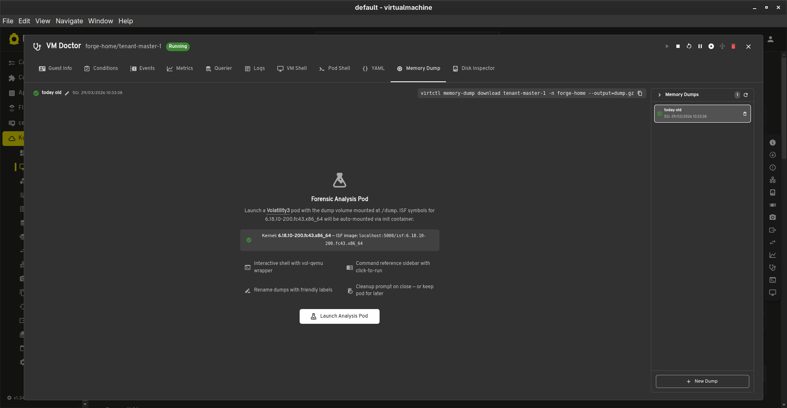

**Disk Inspector** - Boot a lightweight Alpine VM with the selected disk(s) attached as secondary block devices. Browse files, inspect partitions, repair bootloaders, and check installed packages.

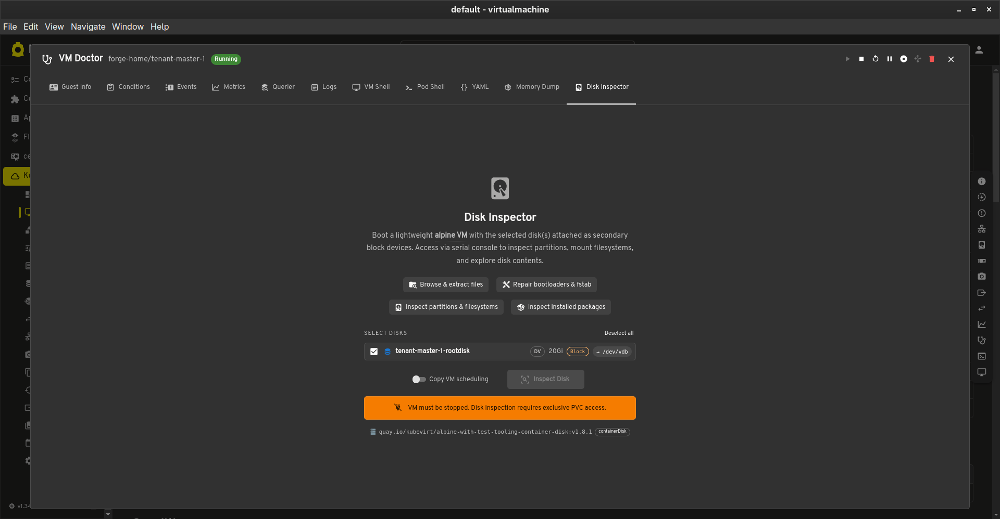

### Image Catalog

Browse built-in OS images and add custom entries via ConfigMaps. Hide/show images from pickers, searchable by name and category. See [Image Catalog documentation](docs/image-catalog/README.md) for details on adding custom entries.

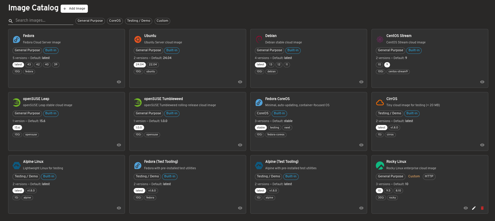

### Settings

KubeVirt and CDI version information with system health monitoring powered by Prometheus (component status, REST client errors, API latency, VMI phase transitions, vCPU wait time).


Plugin features section for VM delete protection (ValidatingAdmissionPolicy), forensic toolbox configuration (Volatility3 images), and disk inspector image settings.

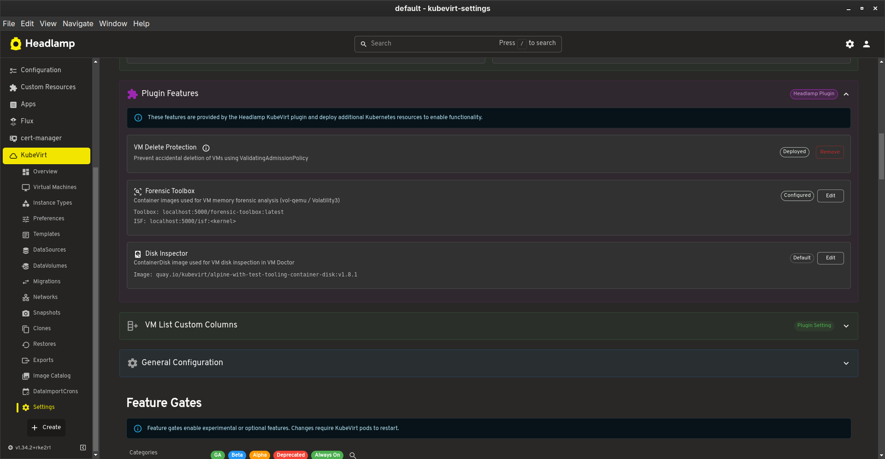

General configuration with configurable metrics endpoint (supports Prometheus, Thanos, Grafana Mimir via service picker or manual URL), Prometheus monitoring (ServiceMonitor), RBAC aggregation, common instance types deployment, and memory overcommit settings.

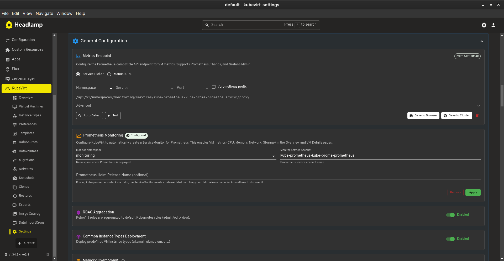

Feature gates with maturity labels (GA, Beta, Alpha, Deprecated) and "Always On" indicators for gates that are enabled by default based on the detected KubeVirt version. Categorized by Storage, Network, Compute, Devices, Security, Migration, Display, and Other.


## Prerequisites

- Kubernetes cluster with [KubeVirt](https://kubevirt.io/user-guide/cluster_admin/installation/) installed
- [CDI (Containerized Data Importer)](https://github.com/kubevirt/containerized-data-importer) for storage features
- Headlamp >= 0.24.0

## Installation

### Option 1: Desktop App (Plugin Mode)

For users running the Headlamp desktop application (Linux, macOS, Windows).

#### From Release Artifact

1. Download the latest `headlamp-kubevirt-*.tar.gz` from the [Releases](https://github.com/naval-group/headlamp-kubevirt/releases) page

2. Extract to your Headlamp plugins directory (the archive creates the `kubevirt/` folder automatically):

   **Linux (native)**

   ```bash
   tar -xzf headlamp-kubevirt-*.tar.gz -C ~/.config/Headlamp/plugins/
   ```

   **Linux (Flatpak)**

   ```bash
   tar -xzf headlamp-kubevirt-*.tar.gz -C ~/.var/app/io.kinvolk.Headlamp/config/Headlamp/plugins/
   ```

   **macOS**

   ```bash
   tar -xzf headlamp-kubevirt-*.tar.gz -C ~/Library/Application\ Support/Headlamp/plugins/
   ```

   **Windows (PowerShell)**

   ```powershell
   tar -xzf headlamp-kubevirt-*.tar.gz -C "$env:APPDATA\Headlamp\Config\plugins\"
   ```

3. Restart (or reload) Headlamp

#### From Source

```bash
git clone https://github.com/naval-group/headlamp-kubevirt.git
cd headlamp-kubevirt
npm install
npm run build
```

Then copy the files to the appropriate plugins directory:

```bash
mkdir -p ~/.var/app/io.kinvolk.Headlamp/config/Headlamp/plugins/kubevirt
cp dist/main.js package.json ~/.var/app/io.kinvolk.Headlamp/config/Headlamp/plugins/kubevirt/
```

### Option 2: In-Cluster (Container Mode)

For Headlamp deployed as a Kubernetes service. The plugin is served as an init container that copies the built plugin into a shared volume.

#### Using Helm

If you deploy Headlamp with the [official Helm chart](https://headlamp.dev/docs/latest/installation/in-cluster/), add the plugin as an init container:

```yaml
# values.yaml
initContainers:
  - name: headlamp-kubevirt
    image: ghcr.io/naval-group/headlamp-kubevirt:latest
    command: ['/bin/sh', '-c']
    args:
      - 'cp -r /plugins/kubevirt /headlamp-plugins/'
    volumeMounts:
      - name: headlamp-plugins
        mountPath: /headlamp-plugins

volumeMounts:
  - name: headlamp-plugins
    mountPath: /headlamp/plugins

volumes:
  - name: headlamp-plugins
    emptyDir: {}
```

Then install/upgrade:

```bash
helm repo add headlamp https://headlamp-k8s.github.io/headlamp/
helm upgrade --install headlamp headlamp/headlamp -f values.yaml
```

#### Using kubectl

```yaml
apiVersion: apps/v1
kind: Deployment
metadata:
  name: headlamp
spec:
  template:
    spec:
      initContainers:
        - name: headlamp-kubevirt
          image: ghcr.io/naval-group/headlamp-kubevirt:latest
          command: ['/bin/sh', '-c']
          args:
            - 'cp -r /plugins/kubevirt /headlamp-plugins/'
          volumeMounts:
            - name: headlamp-plugins
              mountPath: /headlamp-plugins
      containers:
        - name: headlamp
          image: ghcr.io/headlamp-k8s/headlamp:latest
          args:
            - '-plugins-dir=/headlamp/plugins'
          volumeMounts:
            - name: headlamp-plugins
              mountPath: /headlamp/plugins
      volumes:
        - name: headlamp-plugins
          emptyDir: {}
```

## Development

```bash
# Install dependencies
npm install

# Start development server (with hot reload)
npm run start

# Build for production
npm run build

# Run tests
npm run test

# Lint
npm run lint

# Type check
npm run tsc
```

## License

Apache-2.0
