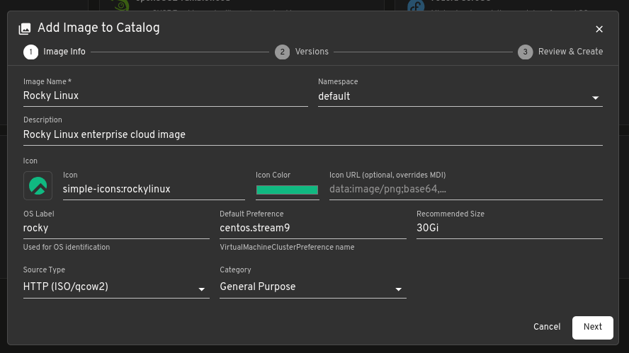
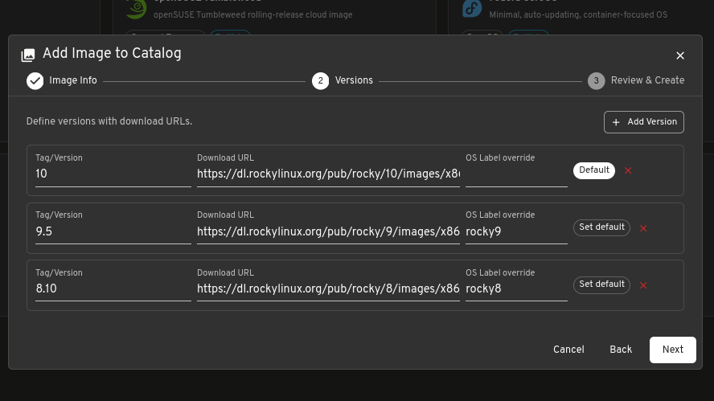
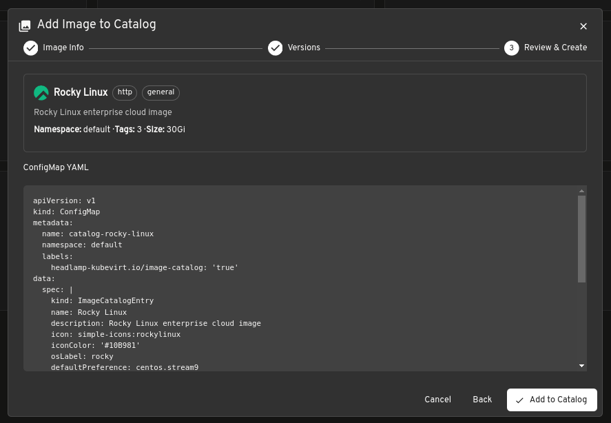
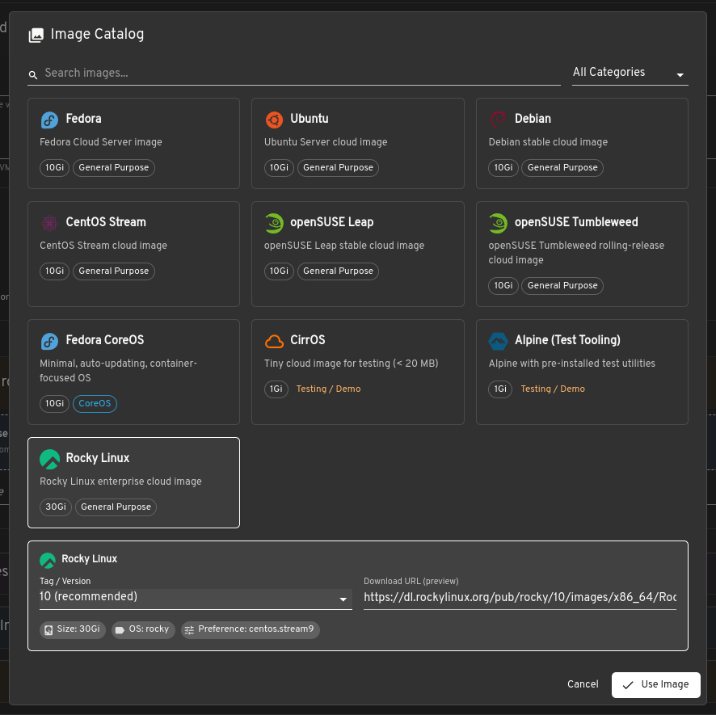

# Image Catalog

The Image Catalog lets you manage OS images available for VM creation. It ships with built-in images (Fedora, Ubuntu, Debian, CentOS Stream, openSUSE, Alpine, CirrOS, etc.) and supports adding custom entries via Kubernetes ConfigMaps.

Custom entries show up alongside built-in ones in the catalog page, in the image picker when creating VMs, and in the DataImportCron image picker.


## Built-in images

The plugin includes containerdisk images from quay.io that work out of the box with KubeVirt. These are read-only and cannot be edited or deleted from the UI. Each built-in image has a set of tags, a recommended disk size, an OS label, and optionally a VirtualMachineClusterPreference name.

## Custom catalog entries

Custom images are stored as ConfigMaps with the label `headlamp-kubevirt.io/image-catalog: "true"`. The plugin discovers them across all namespaces and merges them into the catalog. If a custom entry has the same name as a built-in, the custom entry takes precedence.

### Adding a custom image from the UI

Click "Add Image" on the catalog page. The wizard has three steps:

**Step 1: Image Info**

Fill in the image name, description, icon, OS label, default preference, recommended size, source type, and category. The namespace selector controls where the ConfigMap will be created.

- Source Type "Container Disk" is for containerdisk images hosted in a registry (e.g., quay.io). You provide the registry URL and tags are appended as `:tag`.
- Source Type "HTTP" is for qcow2 or ISO images downloadable over HTTP. Each tag/version gets its own download URL.



**Step 2: Versions**

Define tags (versions) for the image. For HTTP sources, each version needs a download URL. You can set OS label overrides per tag if different versions map to different OS identifiers.



**Step 3: Review and Create**

Review the final ConfigMap YAML and click "Add to Catalog". The ConfigMap is created in the selected namespace.



### Adding a custom image with kubectl

Apply a ConfigMap with the catalog label. The `data.spec` field contains a YAML document describing the image.

Here is a full example for Rocky Linux with HTTP sources:

```yaml
apiVersion: v1
kind: ConfigMap
metadata:
  name: catalog-rocky-linux
  namespace: default
  labels:
    headlamp-kubevirt.io/image-catalog: "true"
data:
  spec: |
    kind: ImageCatalogEntry
    name: Rocky Linux
    description: Rocky Linux enterprise cloud image
    icon: simple-icons:rockylinux
    iconColor: '#10B981'
    osLabel: rocky
    defaultPreference: centos.stream9
    recommendedSize: 30Gi
    category: general
    sourceType: http
    tags:
      - name: "10"
        default: true
        url: https://dl.rockylinux.org/pub/rocky/10/images/x86_64/Rocky-10-GenericCloud-Base.latest.x86_64.qcow2
      - name: "9.5"
        url: https://dl.rockylinux.org/pub/rocky/9/images/x86_64/Rocky-9-GenericCloud-Base.latest.x86_64.qcow2
        osLabel: rocky9
      - name: "8.10"
        url: https://dl.rockylinux.org/pub/rocky/8/images/x86_64/Rocky-8-GenericCloud-Base.latest.x86_64.qcow2
        osLabel: rocky8
```

Apply it:

```bash
kubectl apply -f rocky-linux-catalog.yaml
```

The image will appear in the catalog immediately after a page refresh.

### Containerdisk example

For images hosted in a container registry:

```yaml
apiVersion: v1
kind: ConfigMap
metadata:
  name: catalog-my-image
  namespace: default
  labels:
    headlamp-kubevirt.io/image-catalog: "true"
data:
  spec: |
    kind: ImageCatalogEntry
    name: My Custom Image
    description: Internal image for testing
    icon: mdi:linux
    iconColor: '#FFA500'
    osLabel: custom-linux
    recommendedSize: 10Gi
    category: custom
    sourceType: containerdisk
    registry: registry.example.com/images/my-image
    tags:
      - name: latest
        default: true
      - name: "1.0"
```

## ConfigMap spec reference

| Field | Required | Description |
|-------|----------|-------------|
| `name` | Yes | Display name shown in the catalog |
| `description` | No | Short description of the image |
| `icon` | No | Iconify icon name (e.g., `mdi:linux`, `simple-icons:rockylinux`). Defaults to `mdi:package-variant` |
| `iconColor` | No | Hex color for the icon |
| `iconUrl` | No | Base64 data URI or URL for a custom icon. Takes precedence over `icon` |
| `osLabel` | No | OS identifier string. Defaults to lowercase name |
| `defaultPreference` | No | VirtualMachineClusterPreference name to use when creating VMs from this image |
| `recommendedSize` | No | Recommended disk size (e.g., `10Gi`, `30Gi`). Defaults to `10Gi` |
| `category` | No | `general`, `coreos`, `testing`, or `custom`. Defaults to `custom` |
| `sourceType` | No | `containerdisk` or `http`. Defaults to `containerdisk` |
| `registry` | No | Container image registry URL (for containerdisk sources). Tags are appended as `:tag` |
| `tags` | No | List of versions. Can be simple strings or objects with `name`, `default`, `url`, `osLabel`, `defaultPreference` |

### Tag object fields

| Field | Required | Description |
|-------|----------|-------------|
| `name` | Yes | Tag/version name (e.g., `latest`, `10`, `9.5`) |
| `default` | No | Set to `true` for the default tag |
| `url` | No | Download URL for HTTP source types |
| `osLabel` | No | OS label override for this specific tag |
| `defaultPreference` | No | Preference override for this specific tag |

## Using catalog images

### VM creation

When creating a VM, the image picker dialog shows all visible catalog entries. Select an image, pick a tag, and click "Use Image". The form is populated with the registry URL (or HTTP URL), disk size, OS label, and preference.



For HTTP sources, the image is imported as a DataVolume with an HTTP source. For containerdisk sources, it is used directly as a container disk.

### DataImportCron

The DataImportCron image picker also shows catalog entries, but only containerdisk sources. This is a limitation of CDI (Containerized Data Importer): DataImportCron only supports registry and PVC sources. HTTP sources are not accepted by the CDI webhook even though the field exists in the CRD schema.

If you select an HTTP image in the DataImportCron picker, you will see a warning explaining this.

## Hiding images

Each catalog tile has an eye icon in the bottom-right corner. Clicking it hides the image from all pickers (VM creation, DataImportCron). Hidden images are still visible on the catalog page when the "show hidden" toggle is enabled.

Hidden state is stored in the browser's localStorage, so it is per-browser and does not affect other users.

## Editing and deleting custom entries

Custom entries (from ConfigMaps) have edit and delete buttons on their catalog tiles. Built-in entries cannot be modified.

To edit or delete via CLI:

```bash
# Edit
kubectl edit configmap catalog-rocky-linux -n default

# Delete
kubectl delete configmap catalog-rocky-linux -n default
```

## Overriding built-in images

If you create a custom entry with the same name as a built-in image (e.g., "Fedora"), your custom entry replaces the built-in one in the catalog. This lets you point built-in names to internal mirrors or different versions.

## Limitations

- HTTP sources cannot be used with DataImportCron. CDI only accepts registry and PVC sources for automatic imports.
- The hidden images state is per-browser (localStorage). There is no cluster-wide way to hide images for all users.
- Custom icons via `iconUrl` must be a data URI (base64) or a URL reachable from the browser. The plugin does not proxy icon URLs through the Kubernetes API.
- The `defaultPreference` field must match an existing VirtualMachineClusterPreference in the cluster. If it does not exist, VM creation will still work but without preference-based defaults.
